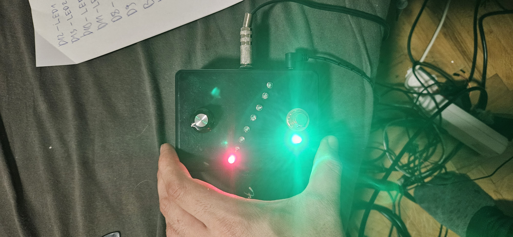

Drop Tunning pedal amateur attempt of recreating a diy version of digitech drop pedal. You can down tune your guitar by 12 semitones and the control is in semitones with a rotary encoder. Also i am using 8 red leds for the display of current semitone. When it goes under 8 semitones, the 1-4th led lights up and the 8th led until 12 semitones. It can be really improved by using an optimized algorithm 
for pitch shifting. 

i am using this equation for the pitch shifting

for the hardware i used stm32h723vgt6 microcontroller devboard by we act studio, along with rotary encoder and its internal adc3 and dac1  channel two peripheral in a dma circular buffer.
Big thanks to the YetAnotherElectronicsChannel on youtube where i used a part of his algorithm but i am using a single channal internal dac and adc. 
https://www.youtube.com/watch?v=p_a8mDcAvOg
https://github.com/YetAnotherElectronicsChannel/STM32_DSP_PitchShift
For more info checkout his briliant channel and github.
I am using stm32cube IDE.

for leds pins are resistor of 100ohms between ground and negative pins of the leds and for postive for these peripheral pins
B15 - 1
B14 - 2
D9 - 3
D8 - 4
D11 - 5
D10 - 6
D13 - 7
D12 - 8
and for dac
DAC OUT - A5
and for adc 
ADC IN - PC1
and for rotary encoder 
DATA - A6
CLK - A7
links for the hardware:
rotary encoder: https://www.aliexpress.com/item/32790788377.html?spm=a2g0o.order_list.order_list_main.17.37111802AF5FNg
stm32h723vgt6 dev board:
https://www.aliexpress.com/item/1005005872938104.html?spm=a2g0o.order_list.order_list_main.23.653018027IkY90
buck converter from 9v-5v ajdusted dc:
https://www.aliexpress.com/item/1005004904872120.html?spm=a2g0o.productlist.main.3.74b3hc1ihc1icY&algo_pvid=024881db-1f5f-46ae-ae84-1a283f5308e5&algo_exp_id=024881db-1f5f-46ae-ae84-1a283f5308e5-1&pdp_npi=4%40dis%21MKD%2127.80%2122.13%21%21%210.49%210.39%21%40212a6e3217293266198778319ee8b0%2112000030968453860%21sea%21MK%211946146683%21X&curPageLogUid=2419dJE0l71l&utparam-url=scene%3Asearch%7Cquery_from%3A
reverse polarity protection 1n4007 diode: 
https://www.aliexpress.com/item/32633071171.html?spm=a2g0o.order_list.order_list_main.15.7b521802OJZpkn
leds:
https://www.aliexpress.com/item/1005003483614644.html?spm=a2g0o.order_list.order_list_main.105.7b521802OJZpkn
dc jacks:
https://www.aliexpress.com/item/1005006987299600.html?spm=a2g0o.order_list.order_list_main.146.7b521802OJZpkn
silicone wire for wiring everything:
https://www.aliexpress.com/item/1005006871233984.html?spm=a2g0o.order_list.order_list_main.198.7b521802OJZpkn
1/4inch audio female jack:
https://www.aliexpress.com/item/1005006612950070.html?spm=a2g0o.order_list.order_list_main.238.7b521802OJZpkn
for bypass wiring here is the schematic

This is how it looks. And for demo video see: https://youtu.be/KL7TbIqP2Is

